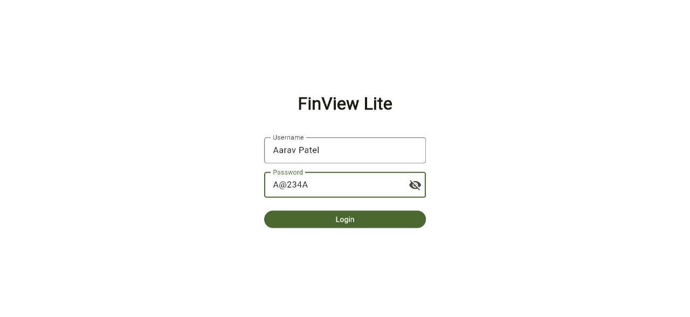
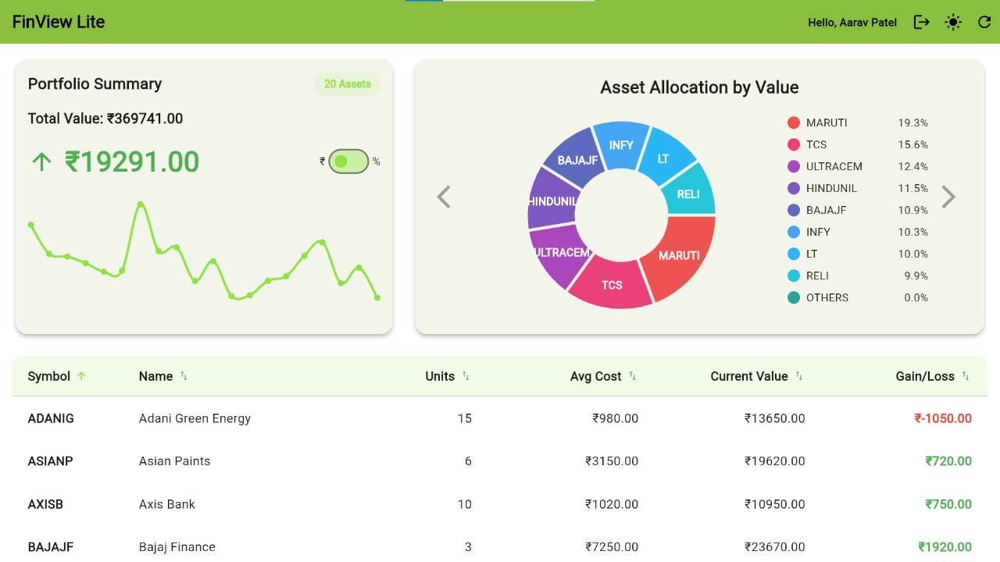
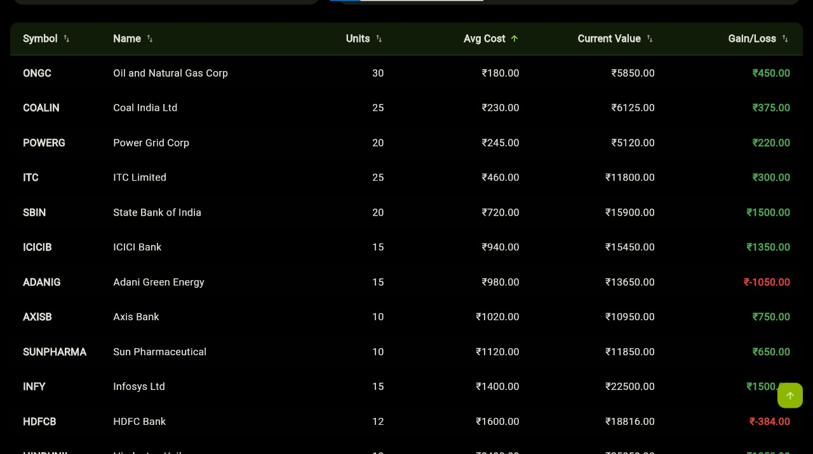
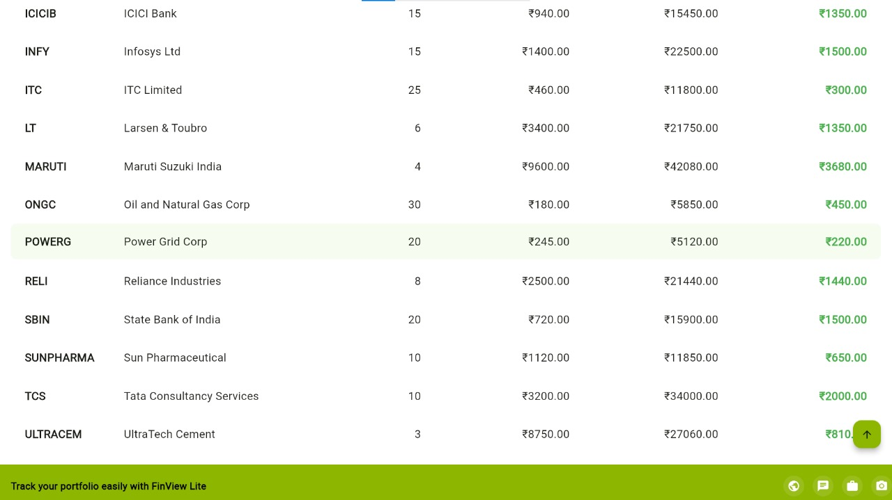
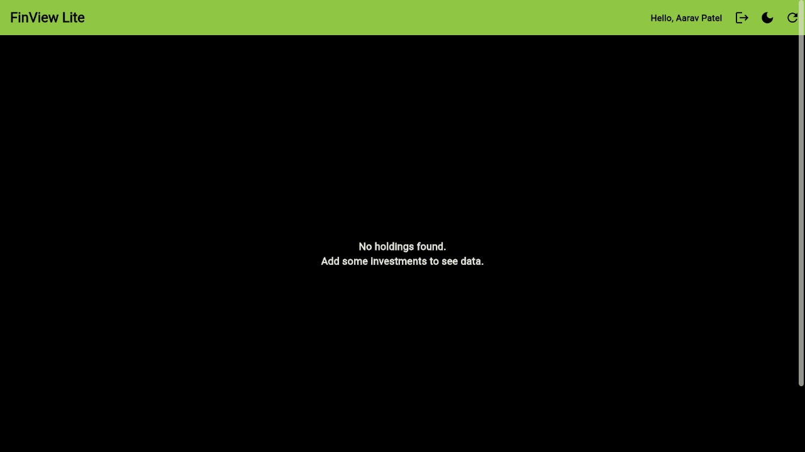
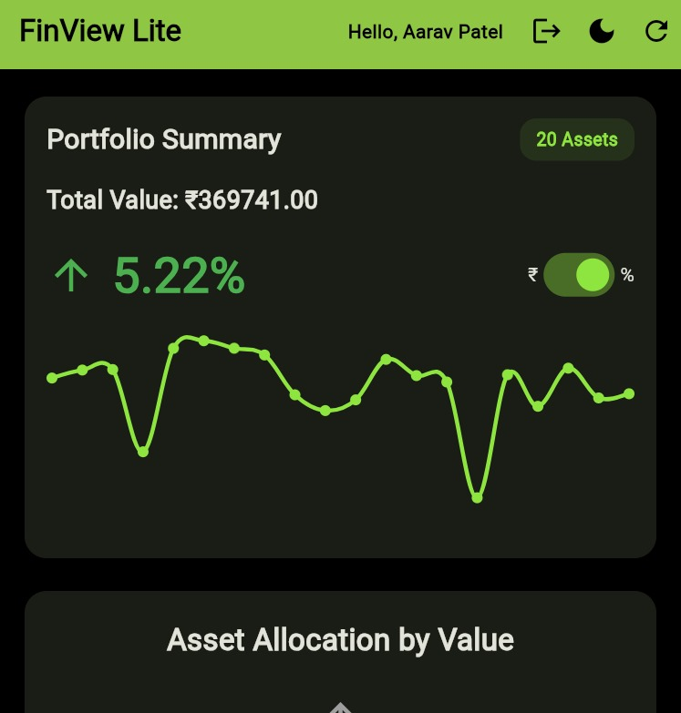

# 🚀 FinView Lite — Investment Insights Dashboard 📊

**FinView Lite** is a **Flutter-based investment portfolio management dashboard** that provides users with an interactive and insightful view of their financial holdings. Designed for **simplicity, responsiveness, and visual clarity**, it works seamlessly across **mobile, desktop, and web platforms**.

FinView Lite is more than a dashboard — it's an exploration of the investment universe, where every interaction reflects how financial decisions shape your portfolio journey.

---

## 🌟 Features

### 🔐 Authentication & User Management
- **Mock Login** using local JSON data (`assets/portfolio.json`)
- **Password Policy**: Minimum 6 characters, at least one uppercase letter, one number, and one symbol
- **Persistent Sessions** with **Shared Preferences**
- **Logout** clears session and returns to login screen

### 📈 Dashboard & Portfolio Visualization
- **Portfolio Summary Card**
  - Displays total portfolio value and gain/loss
  - Toggle between **absolute** and **percentage gain**
  - Includes animated sparkline chart showing performance trends

- **Interactive Asset Allocation Chart**
  - Pie chart for top holdings by value, units, gain, or loss
  - Hover highlights table row (web only)
  - Click a slice to scroll to the holding in the table

- **Holdings Table**
  - Displays symbol, name, units, average cost, current value, and gain/loss
  - Hover highlights rows; click opens detailed popup info
  - Columns are **sortable** (symbol, name, units, value, gain/loss)

- **Portfolio Refresh**
  - Manual refresh simulates updated prices
  - Snackbars provide feedback for success or failure

### 🎨 Theme & Customization
- **Dark/Light Mode Toggle**
- **Philosophical space-themed color palette** symbolizing growth and evolution of investments

---

## 🧾 Demo Login Credentials

| Username     | Password |
|---------------|-----------|
| Aarav Patel   | A@234A    |

---

## ⚙️ Installation & Setup

### 1. **Clone the Repository**
```bash
git clone https://github.com/shrinandsawant/finview_lite.git
cd finview_lite
```

### 2. **Install Dependencies**
```bash
flutter pub get
```

### 3. **Run the App**

- **Web:**
```bash
flutter run -d chrome
```

- **Desktop (Windows):**
```bash
flutter run -d windows
```

- **Mobile:**
```bash
flutter run -d <device_id>
```

---

## 🧩 Version & Environment

```yaml
version: 1.0.0+1

environment:
  sdk: ^3.9.2
```

---

## 📦 Dependencies

```yaml
dependencies:
  flutter:
    sdk: flutter

  fl_chart: ^0.70.1
  provider: ^6.0.5
  shared_preferences: ^2.1.1
  rive_animated_icon: ^2.0.5
```

---

## 🧪 Dev Dependencies

```yaml
dev_dependencies:
  flutter_test:
    sdk: flutter
  flutter_lints: ^5.0.0
```

---

## 🗂️ Project Structure

```
finview_lite/
│
├─ assets/
│   ├─ portfolio.json              # Mock data
│   ├─ screenshots/                # Screenshots for README
│   └─ videos/
│       └─ FinViewLiteVideo.mp4    # Demo video recording
│
├─ lib/
│   ├─ main.dart                   # Entry point
│   ├─ models/                     # Portfolio and holdings models
│   ├─ screens/                    # Login, Dashboard, Summary screens
│   ├─ widgets/                    # Charts, tables, cards
│   └─ theme/                      # AppTheme.dart for colors and fonts
│
├─ pubspec.yaml                    # Flutter dependencies and version
└─ README.md                       # This file
```

---

## 🎥 Video Recording

Watch the live demonstration here:  
📂 `assets/videos/FinViewLiteVideo.mp4`

---

## 📸 Screenshots

### Login Screen


### Dashboard
  


### Holdings Table
  


### No Data Handling


### Responsiveness


---

## 📝 Notes
- All data is mocked locally in `assets/portfolio.json`  
- Charts use Flutter’s **fl_chart** library  
- Fully **responsive** for mobile, desktop, and web  
- Optimized hover and click interactions for web  
- Supports **dark and light themes**  
- Table features like **sorting, highlighting, and popups** enhance usability  

---

## 💡 Suggested Enhancements
- Add real-time **API-based portfolio updates**  
- Integrate **Firebase authentication**  
- Support **live stock/crypto data**  
- Enhance **animations and transitions**  

---

## 📄 License
This project is **open-source** and free to use for learning and demonstration purposes.

🔗 **GitHub Repository:** [FinView Lite on GitHub](https://github.com/shrinandsawant/finview_lite)

